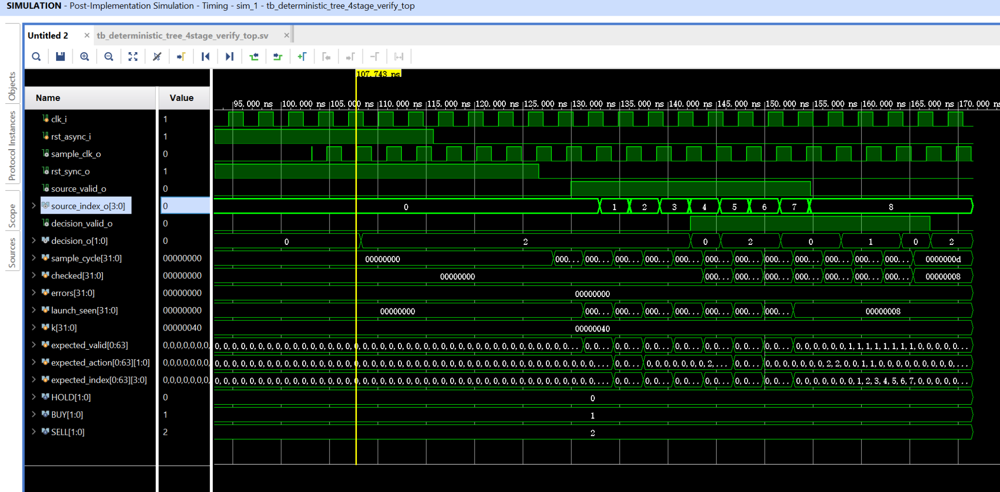
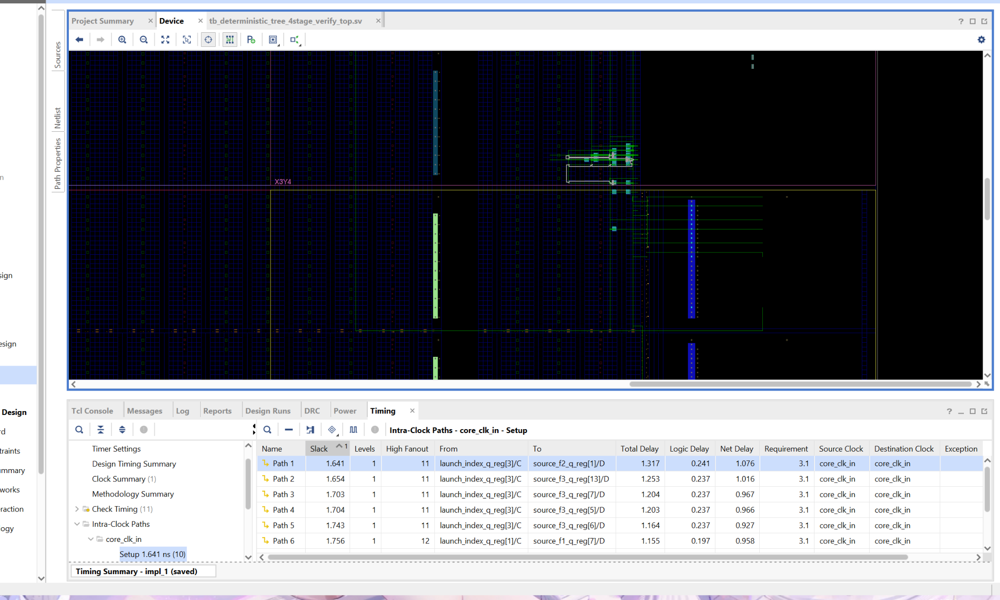
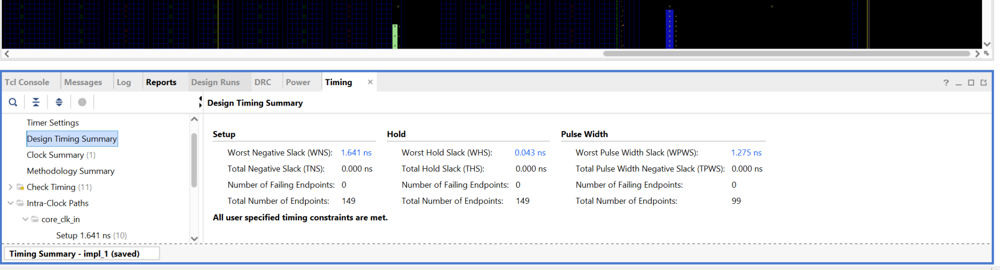

## Physical RTL 3-Stage Decision Tree

A reusable deterministic FPGA decision-tree inference core for AI Trader and other bounded real-time inference workloads.

Verified contract
Clock: 322.56 MHz (3.1002 ns)
Latency: 3 cycles from implemented Source FDRE/Q to registered Decision FDRE/Q
Registered latency: 9.3006 ns (3 x 3.1002 ns)
Throughput: 1 inference per cycle after pipeline fill
Implemented logic levels: C2 compare FDRE/Q -> Decision FDRE/D = 1 LUT level; C1 feature FDRE/Q -> C2 compare FDRE/D = 2 LUT levels (worst of 7 endpoints)
Post-Implementation Timing Simulation: 8/8 leaves checked, 0 errors
Post-route timing: WNS +1.575 ns, WHS +0.046 ns, 0 failing endpoints

The previous four-stage version (WNS +1.641 ns, 12.4008 ns) is kept as the baseline at tag v1-4stage.

Physical pipeline
text
Source FDRE/Q at cycle N
  -> C1 fixed feature capture
  -> C2 seven parallel signed threshold comparators
  -> C3 eight one-hot leaf equations merged with the constant-folded
        action encoder, registered BUY / SELL / HOLD decision at cycle N+3

The core uses compile-time feature routing, bounded signed comparisons and a registered action encoder. Leaf decode and action encode are merged into one logic level: with the default parameters each decision bit depends on only four comparator bits, so it maps to a single LUT between compare_q and decision_o. Users can replace feature selection, thresholds, leaf actions and verification vectors with parameters exported from their own AI training or calibration flow. The logic-level result above is for the default parameters; re-check the implemented depth after changing the tree.

## Evidence

### Post-Implementation Timing Simulation

[Open the full-resolution waveform](./docs/post-implementation-timing-waveform.png)

### Post-route device and timing paths

[Open the full-resolution post-route device view](./docs/post-route-device-and-timing.png)

### Post-route timing summary

[Open the full-resolution timing summary](./docs/post-route-timing-summary.png)

## Files
text
deterministic_tree_3stage.sv
    Synthesizable parameterized inference core.

deterministic_tree_3stage_verify_top.sv
    Implemented Source-FDRE verification wrapper.

tb_deterministic_tree_3stage_verify_top.sv
    Default eight-leaf reference testbench.

deterministic_tree_3stage_verify_top.xdc
    322.56 MHz benchmark constraints.

create_project_3stage.tcl
    Reproducible Vivado project setup.
Vivado project

Run from the Vivado Tcl Console:

tcl
source /absolute/path/to/create_project_3stage.tcl

The script sets:

text
Design Top     = deterministic_tree_3stage_verify_top
Simulation Top = tb_deterministic_tree_3stage_verify_top

Then run Behavioral Simulation, Synthesis, Implementation and Post-Implementation Timing Simulation.

AI Trader integration

A typical deployment places the trained bounded model inside the current-tick FPGA datapath:

text
Registered fixed-point features
  -> deterministic_tree_3stage
  -> registered decision
  -> hard risk gate
  -> order intent

decision_o is only meaningful when decision_valid_o is high. While the pipeline is filling after reset, decision_o can show a leaf action (for example SELL) with decision_valid_o low, so the hard risk gate must qualify every decision with decision_valid_o.

Training, feature selection and parameter calibration can remain in a Python or CPU control plane. The FPGA core performs the committed inference without a current-tick CPU round trip.
